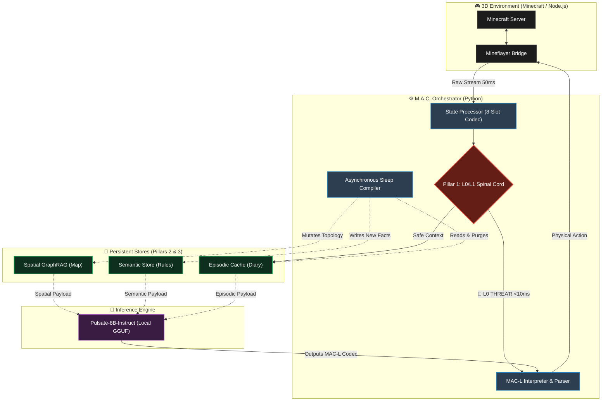

# M.A.C. (Multi-Agent Cognition) Framework
**The Real-Time, Neuro-Symbolic Operating System for Embodied AI Agents.**  
*Created by [Pulsate Labs](https://pulsatelabs.co.za)*

---

## 🌐 Overview

**M.A.C.** is an end-to-end, open-source cognitive architecture designed to solve the three fatal bottlenecks of embodied AI in dynamic 3D environments: **Latency, Context Bloat, and Execution Hallucinations.**

While traditional AI agents rely on slow, probabilistic natural language generation, M.A.C. utilizes a neuro-symbolic framework. It decouples high-level LLM reasoning from low-level physical reflexes, allowing agents to navigate complex 3D worlds, maintain infinite memory persistence, and react to physical threats in under 10 milliseconds using consumer-grade hardware.

This repository serves as the central hub and research archive for the M.A.C. ecosystem. 

---

## 🏗️ The Ecosystem (The Three Pillars)

The M.A.C. framework is highly modular. The core engine is divided into three specialized, open-source infrastructure pillars. 

**Explore the individual repositories below:**

### [Pillar 1: M.A.C. Control Language (MAC-L) & Spinal Cord](https://github.com/IHat0/macl-codec)
*The Translator & Reflex Engine.*
Replaces verbose natural language with a strict, token-efficient Domain-Specific Language (DSL). Features an asynchronous "Spinal Cord" interrupt loop that intercepts environmental threats and executes deterministic survival reflexes in `~0.01ms`—bypassing the LLM entirely for safety-critical actions.

### [Pillar 2: Spatial GraphRAG & "Déjà Vu" Seed System](https://github.com/IHat0/spacial-graghrag)
*The Topological Navigation Engine.*
Bypasses heavy computer vision models by translating 3D worlds into lightweight hierarchical graph databases. Allows agents to query massive maps in `<1.2ms`, mutate broken paths in `11µs`, and inject navigation context into the LLM payload using fewer than 20 tokens.

### [Pillar 3: Tri-Partite Memory & Asynchronous Sleep](https://github.com/IHat0/tri-partite-memory)
*The Infinite-Persistence Database.*
Splits memory into Episodic, Semantic, and Spatial stores. Features an automated "Sleep Consolidation" compiler that compresses daily raw sensory logs by `>96%`. Guarantees 100% retention of critical survival facts while maintaining a perfectly flat active context window of `~183 tokens` over thousands of operational days.

### [The Brain: `macl-codec-8b-instruct`](https://github.com/IHat0/macl-codec-8b-instruct)
*The Native Speaker.*
Our proprietary, fine-tuned `Llama-3.1-8B` model. Quantized to 4-bit GGUF (4.6GB) for fast local inference. It natively translates dense, space-delimited state observations into valid MAC-L opcodes with zero syntax hallucinations.

---

## 📄 Research & Documentation

This repository archives the foundational research, technical validation reports, and architecture blueprints for the M.A.C. Framework. 

*   [**Positioning & Synthesis Paper (PDF)**](https://github.com/IHat0/M.A.C/blob/main/MAC_Research_Paper.pdf) - Architectural framing, comparison against flat-context/RAG systems, and the epistemic discipline behind the M.A.C. design.
*   [**Technical Evaluation Report (PDF)**](https://github.com/IHat0/M.A.C/blob/main/MAC_Technical_Report.pdf) - Proof-of-concept validation of the JARVIS cognitive loop, RCON polling stability, and end-to-end WebSocket integration.

---

## 🎯 The Universal Environment Adapter

M.A.C. is environment-agnostic. While our current simulation benchmarks are run inside Minecraft (serving as an ideal, rigorous 3D physics sandbox), the framework is designed around an **Environment Adapter** abstraction. 

By simply replacing the translation adapter, the M.A.C. cognitive loop and MAC-L opcodes can be plugged directly into physical robotics, digital twin city simulations, or alternative game engines (Unreal/Unity) without retraining the core logic.

---
### 🗺️ System Architecture Diagram

---

## 🏢 About Pulsate Labs

M.A.C. is developed and maintained by **Pulsate Labs Pty Ltd**. We are building the infrastructure for long-horizon autonomous agency. 

For enterprise integration, grant reviews, or academic research partnerships, visit [pulsatelabs.co.za](https://pulsatelabs.co.za) or contact us at `info@pulsatelabs.co.za`.

---
*M.A.C. Framework is released under the Apache License 2.0.*
